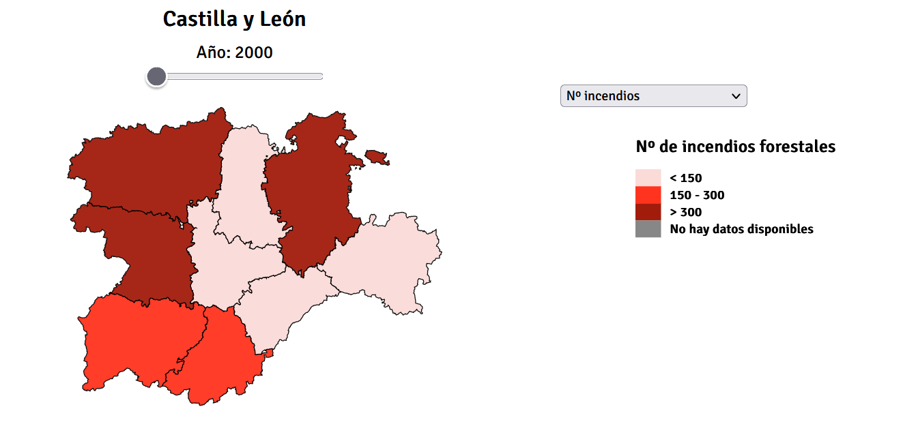
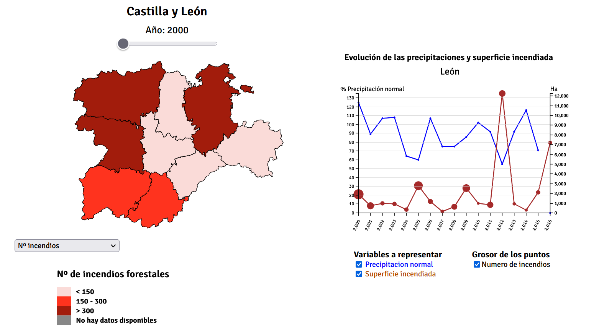

 # Incendios forestales en CyL

 [Enlace a la visualización](https://desi_22-23.pages.gitlab.inf.uva.es/icendiossequia)

 
Se han utilizado los datos correspondientes al dataset: [Indicadores medioambientales de Castilla y León](http://datosabiertos.jcyl.es/web/jcyl/set/es/mediciones/indicadoresambientales/1284227444931), del [Portal de Datos Abiertos](https://datosabiertos.jcyl.es/) de la [Junta de Castilla y León](http://jcyl.es/).

Se han selecionado y transformado los indicadores de interés para nuestro objetivo hasta construir el [dataset](data/Indicadores_mediambientales_reduced.csv) utilizado.

Se puede observar la representación del mapa de CyL con una escala en tres colores de las diferentes variables por cada provincia y año:

- Nº de incendios
- Pocentaje de precipitación normal
- Superficie incendiada

Se puede variar de formar interactiva tanto la variable a representar como el año.

Al pulsar sobre una provincia, se accede a al visualización de la evolución temporal de las variables relacionadas con la precipitación y la superficie.
Se puede incluir en la visualización temporal el número de incendios en forma del grosor de los puntos de la superficie incendiada.

